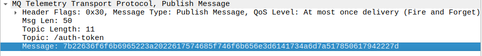
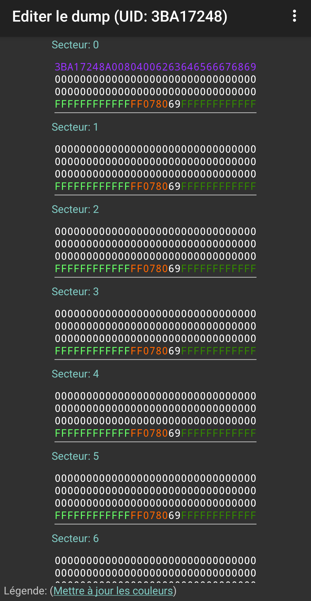
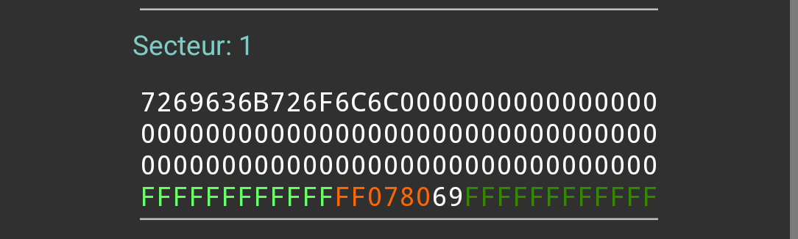
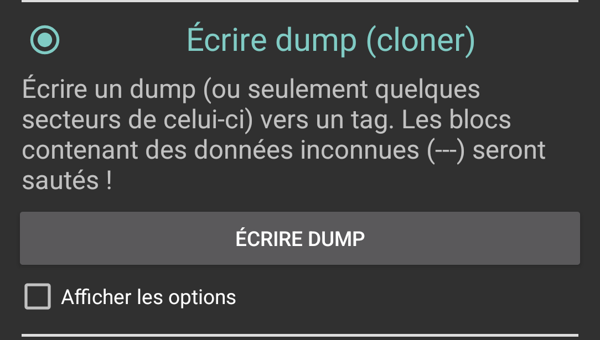

+++ 
draft = false
date = '2025-05-28T16:25:48+02:00'
title = "InterIUT - ESPionnage"
description = "Write Up du challenge ESPionnage du CTF InterIUT 2025"
authors = "Wanako"
tags = ["Hardware", "Reseau", "Reverse"]
categories = ["Hardware", "Reseau", "Reverse"]
+++
Voici un Write Up des challenges `ESPionnage` réaliser par Philippe_Katerine dans le cadre du ctf `interiut 2025`.  
Catégorie: Hardware

---
## Ennoncer Partie 1
Ce challenge se déroule en trois étapes. Le but final étant d’accéder au contenu d'un coffre-fort connecté situé sur la table des Admins. Chaque étape se débloque en résolvant la précédente.

Pour cette première phase, vous interceptez une transmission sur le réseau sans fil de la secte CASTEM lors de l'OTA du coffre. Une capture réseau de cette transmission ainsi qu'une documentation sur le coffre sont à télécharger. À vous de l’analyser pour récupérer le firmware embarqué du système de verrouillage.

Le flag de ce premier challenge est le hash sha256 du binaire. 

Exemple de flag : interiut{sha256(firmware.bin)}

Fichier disponible : ota.pcapng et doc.pdf

---
## Résolution Partie 1

### Analyse du document
Le document présente le contexte ainsi que les différents équipements avec lesquels nous interagirons.

### Analyse de la capture réseaux
La capture réseau est courte, ça nous permet de nous concentrer sur beaucoup d'element.  

  
Résumer des informations importante :
- Les quetes DNS pointent vers `eddymalou.fr` -> `45.147.99.180`.  
- 2 Requete GET sur `eddymalou.fr/firmware.elf`
  - Une rejecter car non connecter (mauvais cookie)
  - Une autre autorisé
  - Pas de possibilité de récuperer le firmware telechargé
- Différent message avec le protocole MQTT

### Résolution
Dans le but d'avoir nous aussi accès au firmware, nous devons generer un bon cookie utilisable sur le site. 
Via la capture, nous comprennons que nous devrons utiliser le protocole MQTT pour réussir à avoir un cookie valable.  

##### MQTT ?
Le protocole **MQTT** (Message Queuing Telemetry Transport) est un protocole de messagerie léger basé sur le modèle publish/subscribe. Il est conçu pour permettre la communication entre des appareils sur des réseaux à faible bande passante ou peu fiables, comme dans les systèmes IoT. Un broker central reçoit les messages publiés sur des "topics" par des clients (publishers) et les distribue aux clients abonnés (subscribers).
Dans notre cas le serveur sera le même que celui utiliser dans capture soit `45.147.99.180`. Celui nous renverra un token utilisable ensuite sur le site internet.  




En ce qui concerne les login et password on peut les voir dans la trame 5.


Maintenant que c'est tout bon, c'est parti !  
Voici un packet permettant de faire des requetes MQTT.
```bash
sudo apt install mosquitto-clients
mosquitto_sub -h 45.147.99.180 -p 1883 -u "iotcastem" -P "tungtungsahur" -t "#"
```
Rapide explication
```plaintext
-h hote à interroger
-p port
-u utilisateur
-P mot de passe
-t topic (# = tout les topics, on pourrait mettre /auth_token)
```

Et tout fonctionne bien, on utilise le cookie reçu pour recuperer le firmware sur la page.  

(Je suis passé par une extension dans le nagivateur pour modifier le cookie)


Pour finir pour avoir le flag, on mets simplement au format.
```bash
sha256sum firmware.elf
23b5141d81e852b5683ddf10a8e8036dd20c5675b4547d4ba44e4407343e50d1  firmware.elf
```
Flag : `interiut{23b5141d81e852b5683ddf10a8e8036dd20c5675b4547d4ba44e4407343e50d1}`

--- 
## Ennoncer Partie 2

Vous avez mis la main sur le firmware du coffre-fort, bravo! CASTEM pensait sa technologie inviolable... mais c’est à vous de prouver le contraire.

Dans cette deuxième phase, vous devrez analyser le binaire extrait et comprendre le fonctionnement interne du système de verrouillage. L’objectif est d’identifier la bonne valeur de la carte autorisée à ouvrir le coffre.

Le firmware a été compilé pour une carte ESP32, et contient tout le code nécessaire à la gestion du lecteur NFC et de l’interface graphique.

Le flag de ce challenge est la string décodée hexa -> ascii de la bonne valeur qui ouvre le coffre.

Exemple de flag : interiut{string_ascii}

## Résolution Partie 2


### Fonctionnement du firmware CASTEM LOCK

L’analyse statique du firmware a été réalisée à l’aide de Ghidra, afin de comprendre le comportement du programme embarqué sur l’ESP32.

Le firmware tourne sur un **ESP32** et utilise un module **NFC PN532** pour lire des cartes **MIFARE Classic**. Son rôle est de vérifier si une carte présentée est valide pour déverrouiller un cadenas.

La logique principale est contenue dans la fonction `loop()`, qui s'exécute en permanence. Toutes les 500 millisecondes, le système vérifie si une carte est détectée. Si c’est le cas :

1. Il lit l’**UID** de la carte et l’affiche.
2. Il tente d’**authentifier le bloc 4** (premier bloc du **secteur 1**) avec une clé par défaut.  
`uVar3 = PN532::mifareclassic_AuthenticateBlock(&nfc, uid, uidLength, 4, '\0', defaultMifareKey);`  
3. Si l’authentification réussit, il lit les **données du bloc 4**.  
`PN532::mifareclassic_ReadDataBlock(&nfc,'\x04',data);`  
4. Il compare ces données avec une **valeur attendue** (`expectedMifareData`).  
```c
iVar6 = memcmp(data,expectedMifareData,8);
if (iVar6 == 0) {
  Print::println((Print *)&Serial0,s_Access_granted_!_sector_1_matche_3f4001f1);
  status = s_Lock_status:_Access_granted!_3f400228;
  bVar2 = true;
}
else {
  Print::println((Print *)&Serial0,s_Access_denied_!_sector_1_doesn't_3f400245);
  status = s_Lock_status:_Access_denied_3f400282;
  bVar2 = false;
}
```
5. Si les données correspondent, l'accès est accordé et un **code de déverrouillage s'affiche** à l'écran ; sinon, l'accès est refusé.

Le firmware met aussi à jour un **statut d’accès** pour informer l’utilisateur visuellement du résultat.

### Récuper la valeur de `expectedMifareData`

Pour extraire la valeur de `expectedMifareData` dans Ghidra, il suffit d’utiliser la recherche de chaînes intégrée.
Accédez à : **`Search` → `For Strings`** dans la barre de menu.

Une fois les chaînes affichées, vous pouvez repérer facilement la **valeur attendue** comparée par `memcmp`.
Dans ce cas, il s’agit de la chaîne **`rickroll`**.


Flag : `interiut{rickroll}`

---

## Ennoncer Partie 3

Vous avez désormais en main la valeur autorisée par le firmware du coffre-fort. Mais posséder la connaissance ne suffit pas… il vous faut maintenant agir, comme le ferait un véritable initié de la secte.

Chaque équipe a reçu une carte NFC. À vous de trouver une moyen d'ouvrir le coffre sans se faire prendre par les gardes!

Le coffre se trouve sur la table des admins, et le flag final se trouve à l’intérieur du coffre.

## Résolution Partie 3

Pour la partie 3 nous allons donc devoir modifier une carte NFC qui nous a été fournie dans le but d'ouvrir le coffre.

Pour ce faire nous utilisons l'application `mifare classic tool`.
Lancer l’application et choisir lire Tag
Depuis le menu principal de l'app, choisissez l'option "Lire Tag”.  


Une fois détectée, l'application affiche tous les secteurs de la carte.  
Tous sont vides sauf le secteur 0, qui contient l’UID (normal, c’est un secteur non modifiable).



Le firmware attend une valeur spécifique dans le secteur 1, bloc 4.
Grâce à l’analyse faite dans la partie précédente, nous savons que la valeur attendue est la chaîne : `rickroll`  
On l’écrit donc en hexadécimal dans le secteur 1 via l’interface de l’application :  



Une fois les données modifiées, ouvrez le menu ... en haut à droite, puis sélectionnez “Write Dump”.  
L’application va alors écrire les données modifiées sur la carte NFC.  



En posant cette carte sur le coffre-fort des admins, le système reconnaît la chaîne "rickroll" comme valide, et le coffre se déverrouille.

Vous récupérez ainsi le flag final du challenge.

